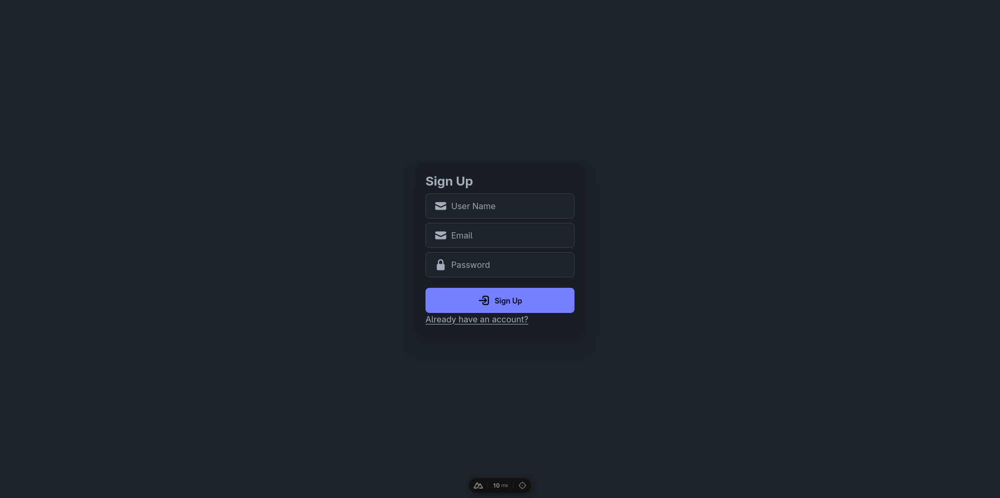
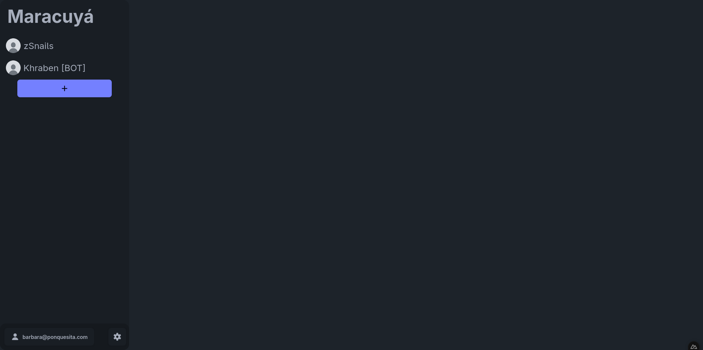
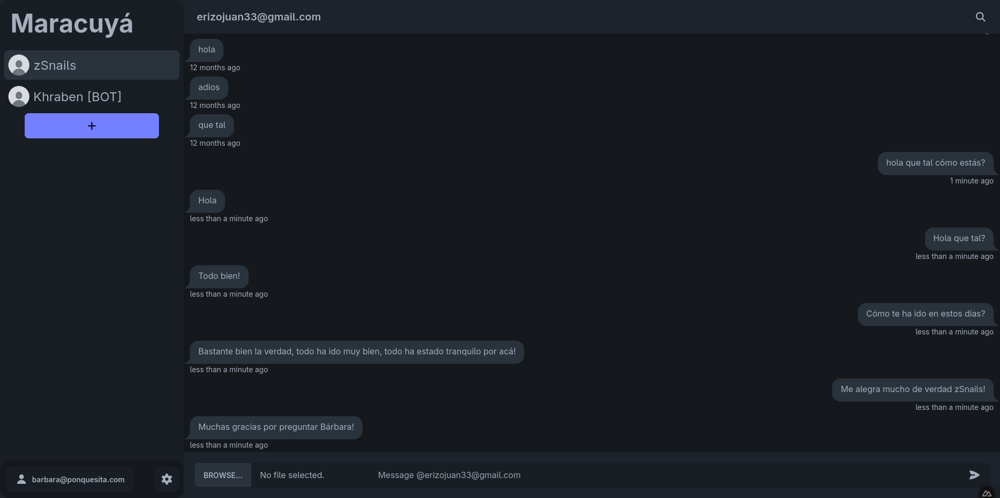
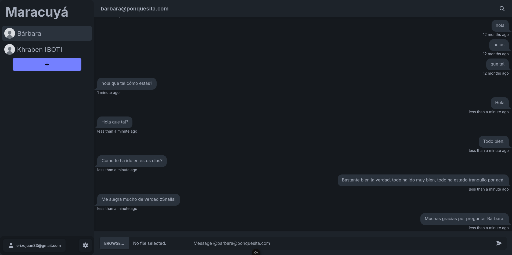

# 💬 Maracuyá Chat

Maracuyá Chat es una aplicación de mensajería en tiempo real diseñada para demostrar
conceptos de concurrencia, paralelismo y sistemas distribuidos. La aplicación permite
a los usuarios comunicarse de forma fluida mediante canales en tiempo real, con
soporte para envío de mensajes, imágenes y videos.

## 🧠 Arquitectura y Diseño

El sistema fue diseñado con un enfoque distribuido y concurrente, garantizando
escalabilidad y una comunicación eficiente entre los usuarios.

**Principios Clave:**

- Concurrencia y paralelismo como eje central del diseño
- Arquitectura modular para separación de responsabilidades
- Clean Code y principios SOLID
- Uso de WebSockets mediante Supabase Realtime para comunicación instantánea

## ⚙️ Tecnologías y Herramientas

- Framework principal: Nuxt (Frontend y Backend integrados)
- Backend as a Service: Supabase
- Autenticación de usuarios
- Almacenamiento de objetos (imágenes y videos)
- Comunicación en tiempo real con Supabase Realtime
- Lenguaje: JavaScript / TypeScript
- Base de datos: PostgreSQL (gestionada por Supabase)
- Versionamiento: Git / GitHub
- Gestión del proyecto: Jira
- Metodología de trabajo: SCRUM

## 💡 Características Principales

- Chats en tiempo real mediante Supabase Realtime (WebSockets)
- Autenticación segura y manejo de sesiones
- Envío y recepción de mensajes, imágenes y videos
- Almacenamiento de archivos en Supabase Storage
- Interfaz moderna desarrollada con Nuxt
- Arquitectura distribuida y escalable

## 📷 Imágenes

